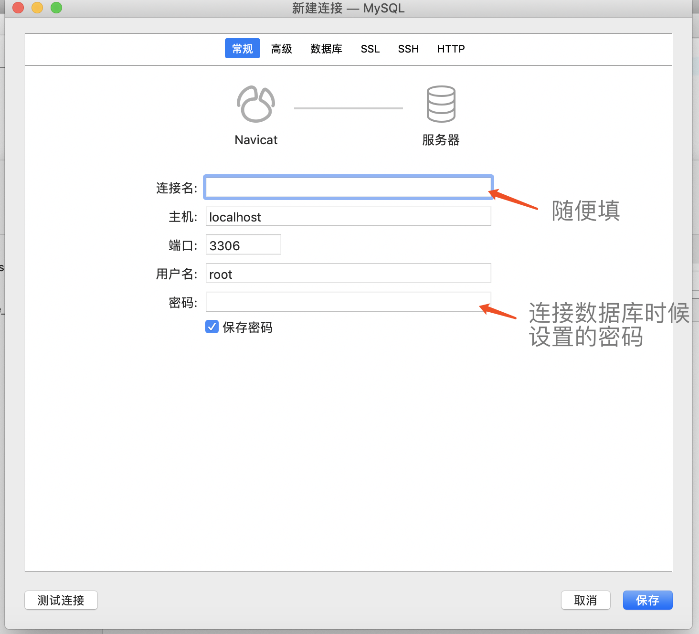

- 为什么使用 MySQL 而不是 MongoDB

  > mysql 是企业内最常用的存储工具，一般都有专人运维
  > mysql 也是社区内最常用的存储工具，有问题随时可查
  > web server 中最流行的关系型数据看
  > 轻量级，易学易用

- 操作数据库
  `账号：root 密码：root123456`

  > 建库
  > 建表
  > 表操作

- 创建数据库
  创建连接
  
  创建数据库
  
  查询数据库：`SHOW DATABASES;`

- 表操作

  > 使用某个数据库 `use myblog;`
  > 显示所有表 `show tables;`
  > 增 `insert into users(username,`password`,realname) values('zhangsan','123456','张三');`
  > 删 `delete from users where username='lisi';`
  > 改 `update users set realname='李四新' where realname='李四';`
  > 查：
  > `select * from users;`[查询全部] 
  > `select id,username from users;`[部分列查询] 
  > `select id,username from users where='zhangsan' and realname=‘张三’;`[条件查询 and]
  > `select id,username from users where username='zhangsan' or realname=‘李四’;`[条件查询 or]
  > `select * from users where username like '%zhang%';` [模糊查询]
  > `select * from users where username like '%zhang%' order by id desc;` [排序 desc是倒序]